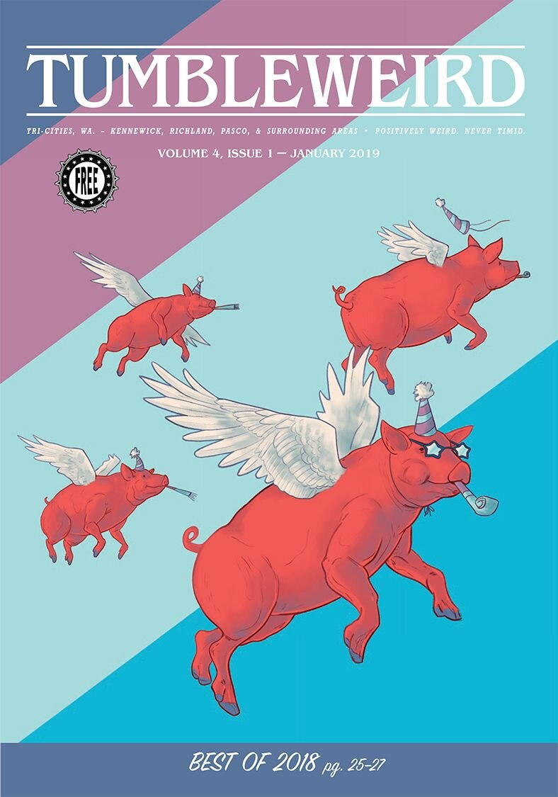

This fall, my partner and I bought [Tumbleweird](http://tumbleweird.org/), a local free alternative paper started a few years ago by some great people who wanted to see a counter-cultural publication in our area along the lines of The Stranger in Seattle and The Portland Mercury.

My co-worker [Jaime](https://www.drawnbyjaime.com) did this incredible illustration for our January issue. ♥️

My role at Tumbleweird is broadly defined as "handling the people part." Practically speaking, this means organizing the work in a way that energizes the volunteers who pour so much of themselves into publishing Tumbleweird each month. But my first order of business is more philosophical. Before we define roles and responsibilities and recruit people who are excited to do those things, we need to know why we're doing all of it. Who are we as a community and what are we trying to accomplish?

Lately I've been obsessed with discovering the purpose of the projects I'm involved in. It started with an excellent book a friend of mine recommended called [_The Art of Gathering: How we meet and why it matters_](http://www.advunderground.com/inventory/801393.php) by Priya Parker. It's about designing in-person gatherings, but I'd recommend it to anyone involved in any project with the goal of creating a specific experience for people.

I read the whole book in a matter of days, and then I went back and have been lingering on the very first chapter for months. This is the chapter about purpose. If you read nothing else in the coming year, read this chapter. It easily had the most impact on my work of anything I read in 2018 (and I read constantly).

Having a clear, sharp purpose for a project helps create intentional experiences and outcomes for everyone involved, both internally and externally. It becomes the yardstick for every decision you make. In addition to that, a clear purpose puts everyone on the same page and is incredibly motivating for people like me who want to work on things that are deeply meaningful.

Parker writes that an effective purpose is:

- Unique: It takes a stand no one else is taking
    
- Specific: It commits to doing one thing well
    
- Disputable: It's willing to unsettle some people
    

Even though Tumbleweird has always been a unique (and disputable!) publication, and I love the many ways it's been described by people who've created it and worked on it, I knew we needed to take all of that background and define a clear, sharp purpose for ourselves.

But we don't want to do that alone. Creating out loud (especially with the people you're making your project for) is a philosophy I wrote about in the first edition of my book, [_Gather the People: A human approach to marketing for people who would rather make what they love than persuade people to buy it_](https://tumbleweird.org/what-is-the-purpose-of-tumbleweird-inquiring-minds-want-to-know/gatherthepeople.com). (I’m working on the second edition now.)

This isn't just a good marketing principle. It's true about all collaborative efforts...when we include people from the beginning, they're more invested in what we're doing, and they become an essential part of shaping the work into something better than we could have envisioned on our own.

## A vaguely scientific, thoroughly collaborative approach to defining the purpose of a project

Here’s how we’ve worked toward defining a clear, sharp purpose for Tumbleweird. Although Priya Parker does an excellent job making the case for doing this in _The Art of Gathering_, she doesn't really explain how. Especially if you want to include other people in the process.

Creative brainstorming is a challenge with even a few people, much less the ~150 folks we've invited to participate so far. Luckily, Adam developed an online tool for this inspired by a system called compression planning. We were introduced to this system when volunteering with the Pasco school district's Enterprise Week this past spring, and it completely changed the way we generate ideas.

### THE BRAINSTORMING PROCESS

First, we devised a set of questions we wanted to explore.

- What do we want to be different because Tumbleweird exists?
    
- How do we want it to feel to be a contributor/reader/part of the Tumbleweird community?
    
- What are the core principles/beliefs/values that define Tumbleweird?
    

Then, we sent these questions individually to past contributors and people we thought should have a voice in Tumbleweird. It was incredible reading their answers. So many people responded at length, and on a short deadline.

We took those answers and compiled them in a [compression planning Trello board](http://purpose-board.tumbleweird.org/) template that Adam devised, creating a list for each question and a card for each idea within each list. We did our best to combine ideas that were similar to make it easier, but even then we ended up with 124 ideas across the three lists, plus 51 other ideas that didn't fall within the question categories.

We then revealed the entire Trello board to everyone we'd invited to participate. We gave each person 5 votes for each question and asked them to choose the answers that best reflected their hope for the future of Tumbleweird.

You can take a look at the Trello board by going to [purpose-board.tumbleweird.org](http://purpose-board.tumbleweird.org/). While voting is now closed, you can see all the answers in order from most to least votes.

What we discovered in doing this is that although there were a wide range of ideas and perspectives, there was a consistent throughline. And although we used this as a data point and not any sort of decision-by-consensus, we wanted to reflect these perspectives in what we came up with.

## Defining a working purpose

We're calling it a "working" purpose because while we spent a lot of time writing it and getting feedback from our editorial board, we want to sit with it and share it with the community before considering it complete.

**Tumbleweird: Positively weird. Never timid.**

> Tumbleweird exists to bring together a more diverse, creative, and progressive community than Eastern Washington gets credit for, in order to connect, highlight, and encourage the betterment of our area.

> We do this by publishing a community-driven paper that uncovers the region’s true identity in a way that’s always positive, often irreverent, and never timid.

> We serve the truly powerful: the underdogs, the misfits, the outsiders, the newcomers, those on the margins, and the ones who defy the status quo. We aren’t beholden to advertisers or authorities. Except for the almighty buttermint lobby.

(There is a whole backstory on buttermints that I will let Adam tell you one of these days.)

## Our next steps

Right now, we’re working on a plan for 2019 that aligns with our purpose, as well as getting clearer on the roles and responsibilities of everyone involved. I’m looking forward to thinking through how an organization actually uses a purpose like this and actively aligns with it on a day-to-day basis, rather than having it become something that’s temporarily inspiring but then never talked about again. If you have thoughts on how you’ve done this, I would [love to hear them](mailto:sarah@tumbleweird.org).
