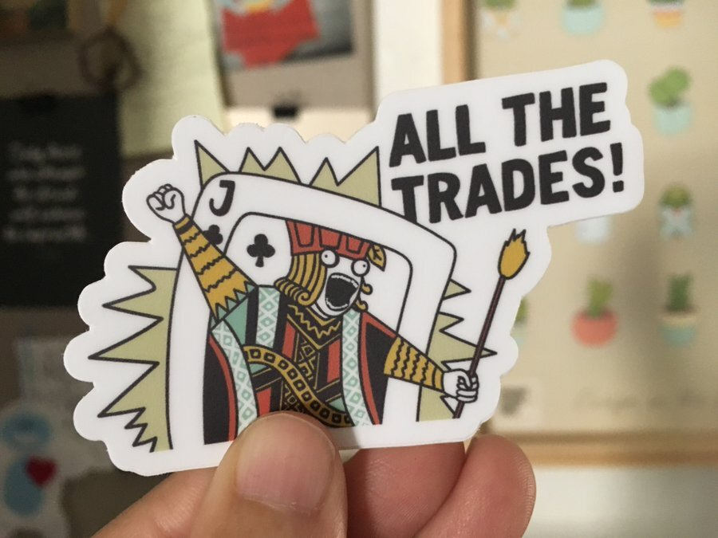
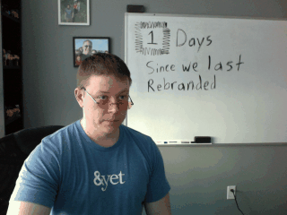

I wrote a newsletter a few weeks ago from Nashville, TN, host of my angsty teen years. We were there to attend a seminar [David Baker](https://www.davidcbaker.com/) was hosting on Advanced Positioning and Lead Generation, which ended up triggering a different kind of angst.

## Positioning angst

Positioning angst...anyone else ever experience this? It’s totally a thing. It’s when a very smart person reminds you that Doing All The Things For Everyone isn’t a strategy and you’re like “oh I _know_ but we have super good reasons for doing it” and then you splutter around a lot and realize that your good reasons are also terrible and that committing to clear positioning is really just a very scary thing to do. And it’s like that for everybody and you’re not special. (Well, you _are_ special but in the same way that everyone else is also special.)

The fear is real. Especially when you have a team of incredibly talented people counting on you to make decisions that will result in more and better work and not less.

We’ve done [a lot of projects over the years](https://andyet.com/showcase), ranging from the impressive to the ridiculous. It’s not only a challenge to find a throughline in all of these things, but to commit to a direction that utilizes our team’s vast range of capability, from marketing strategy to UX design to front-end development to software development. We’re a team of veterans with expertise both broad and deep.

Not only that, but philosophically, we’ve always rebelled against the idea of pigeon-holing ourselves into “just one thing”. We are curious people who incorporate what we learn across disciplines into our work. We believe being a generalist does not mean being a “master of none”. [We do lots of things, and we do them well](https://lynnandtonic.com/thoughts/entries/good-better-best/).

Lynn made these stickers, and they are awesome, and [you can have one of your very own](https://www.etsy.com/listing/650280661/jack-of-all-trades-sticker).

Despite these objections, we know not having clear positioning has cost us. Because we haven’t been clear on who we want to work with and what we want to work on, we haven’t had much control over those things. Thankfully, we’ve worked with good people and have been lucky to fill our calendar through word of mouth. But it means we take what comes rather than deciding what work we really want to be doing and going for that. Not only that, but the volume of incoming projects is just as unpredictable, leading us to gorge ourselves with work one quarter and end up starving the next.

What’s just as unfortunate though (from my perspective) is how we’ve shied away from sharing our expertise over the years. My teammates are seriously brilliant, though they’re too humble to admit it. I learn so much from them, not only from their expertise, but from who they are as people. It has always been my hope that the feeling I get being on this team could be something everyone could experience in some way. But without focus and the creative constraint of having a clear topic/perspective we want to share with people, it’s hard to keep momentum going.

## But how do you commit to a direction whole-heartedly when you’re not sure if it’s the right one?

This is what we’re trying to figure out right now.

One thing David Baker mentioned when the seminar was over was the tendency to come home with a new idea and say, “Okay, team; this is what we’re doing now!”, touting all the ways the new idea is different than all those _other_ ideas you’ve had and why this can’t possibly fail. Instead, he encouraged us to be thoughtful, move ahead slowly, and _do_ things instead of make grand pronouncements.

We are definitely taking this to heart (which is why this post does not include grand pronouncements, despite how much I love them!). We’ve had considerable discussion about who we are, what we’re uniquely good at, what kind of work we want to be doing, and who we want to work with. We’ve written several positioning statements, and the one we have right now feels very, very close to what we’ll likely end up with.

All of that has been interesting, and I’m excited about how far we’ve come. But there’s still the knowledge that at some point, we are going to have to call it “done” and orient all of our efforts toward that end. We’re going to embark on a positioning experiment that we fully commit to publicly, and we won’t know the impact until we try.

## Positioning (and re-positioning) takes courage

We’ve done this before. To the point where this gif of [Gar](https://twitter.com/wraithgar) pops up in Slack whenever anyone mentions the word “rebrand”.

It’s a bit disheartening to look at all those past attempts and ask ourselves, “Is this another one of those?” That’s one reason why the past few years, we decided to accept Doing All The Things as our mantra and tried to create repeatable systems to build our pipeline around that. We’ve dipped our toe into different specializations around projects we’ve worked on, making landing pages for them and adding them to our ever-growing list of offerings.

But without committing whole-heartedly to a direction, even if we know that direction may end up being flawed in some way, we don’t give that direction a chance. It gets lost in a sea of other potentialities, and we don’t give any one thing the energy it would need to succeed.

And so, we are going to be brave and try again. And again and again if we need to. We know we will continue to get projects the way we’ve always gotten them, through generous referrals from clients we’ve loved working with. Committing to a clear position will not change that, which helps mitigate some of the fear. And the rewards when we figure it out, both creatively and financially, are worth the risk.
