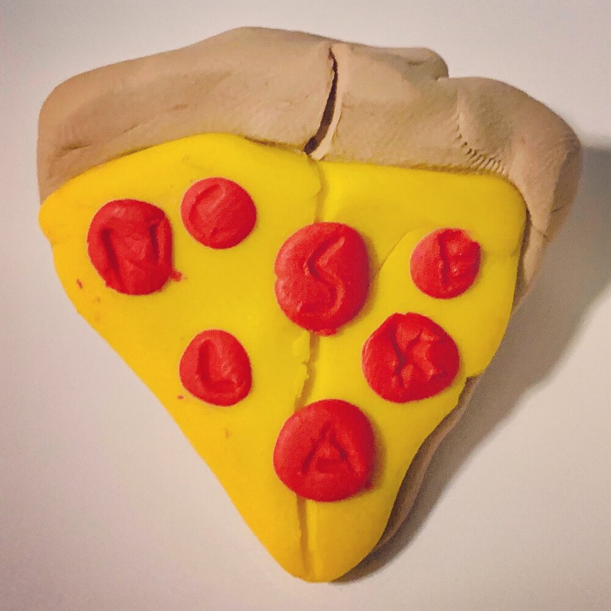

Dear friends, family, and folks we know from the Internet who have squirreled their way into our hearts,

We have a new name!

We were going to wait until the wedding celebration we'd planned for later this spring, but after much conversation, we've decided to change our names now and hold off on a ceremony indefinitely.

Yes, indefinitely. We officially got married on December 28th in what was initially going to be a simple legal document-signing-fest. But the night before, when we told our kids that we’d decided to get married in matching pizza pajamas that Adam’s mom made for us, Lilah (Sarah’s 12-year-old) had an idea.

As soon as everyone arrived at Adam’s parents’ house (including Sarah’s parents, via video chat), Lilah gave us all a gift—a handmade pizza pin that included a pepperoni with each of our initials; two slices joined together with an A and an S on the seam, the Brault kids on one slice and the Bray kids on the other.

As amazing as it sounded to have a second celebration with our loved ones under the stars in May, as the tasks started to pile up, our enthusiasm waned. It seemed unlikely we could (sanely) create an evening that would be as special to us as the first one.

And now, with that decision made, we are very excited to not have to wait any longer to share a name.

"So, are you going to be Sarah Brault then?"

We've heard that question a couple dozen times since telling people we were getting married. Some started writing "Adam and Sarah Brault" on cards and letters, just to be on the safe side.

For a while, we weren't sure about the answer to that question. We knew we wanted to share our name, but we both had careers built on our existing names, as well as children we shared our names with. It seemed strange that one of us would make the choice to plant new last name roots (most likely Sarah) and the other wouldn't.

And honestly, Adam's always felt a little jealous that women are expected to change their names when they get married. He has always said "I want people to know that I am hers as much as she is mine. If I kept my name, I'm just the same old me!"

Not only that, but we are both different people today than the ones who have lived the other unique iterations of our lives, most significantly because of each other. Why couldn't we both just change our names together?

And so we are. But what to do about choosing a name?

We wanted to choose something that would resonate with our most significant common values—possibility and freedom.

We believe our ability to learn and change and become better people than we were yesterday fills every day with new possibility. We are convinced that the best is always in front of us and that challenges are often the most significant catalysts to our growth. No matter what is going on around us, we are free to choose a new option and a new direction.

At the same time, we wanted to find a common name that would continue to connect us to our roots. We didn't want to abandon our past; we wanted to honor it while living in the truth of our united present and future.

For Adam, this meant something that nodded to the French heritage of the name of his family (Brault), who immigrated from Quebec. for Sarah, she wanted something that felt connected to her maiden name, Havens.

Less important, but still very much on our minds, was where we wanted to be alphabetically. As a couple of longtime B's, we didn't want to be demoted to the end. No way were we ever going to be one of those N-Z "bring a salad to the potluck" couples. (sorry not sorry, N-Z salad-ites.)

We played with a lot of names. Adam jokingly said we should change our last name to Brazen, given the boldness of life we'd embraced. But when one name emerged as an option, we were immediately sure this was it:

Avenir.

French for "future", the name contains our values and our outlook, the middle of Sarah's maiden name, and Adam's family heritage.

It is a statement to ourselves of who we are and where we're going, grounded in the present but ever mindful that each moment we live is another step building upon step into the future.

And so, we are happy to re-introduce ourselves with our new names: Sarah and Adam Avenir.

Pleased to meet you all over again.

♥️ Sarah and Adam
