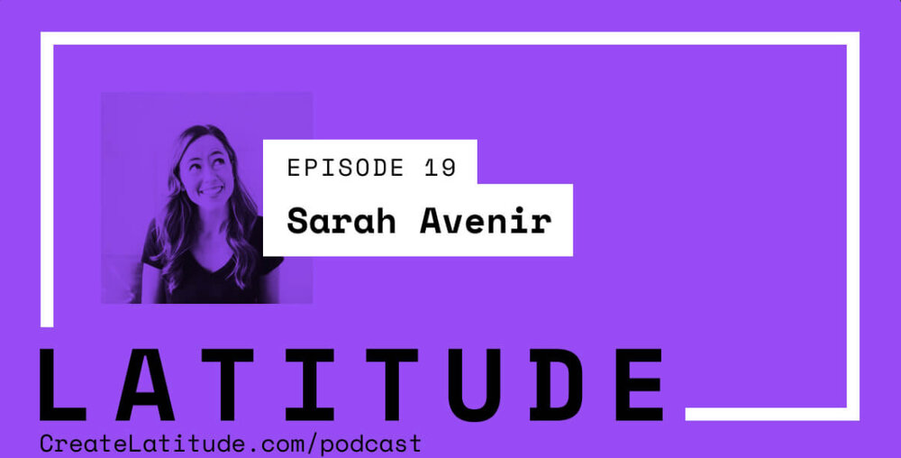

[In this podcast](https://www.createlatitude.com/podcast/sarah-avenir), designer/developer Bryan Zavestoski and I chat about when to take risks, how to be strategically creative, and how to remain entrepreneurial even when being part of a larger organization.
