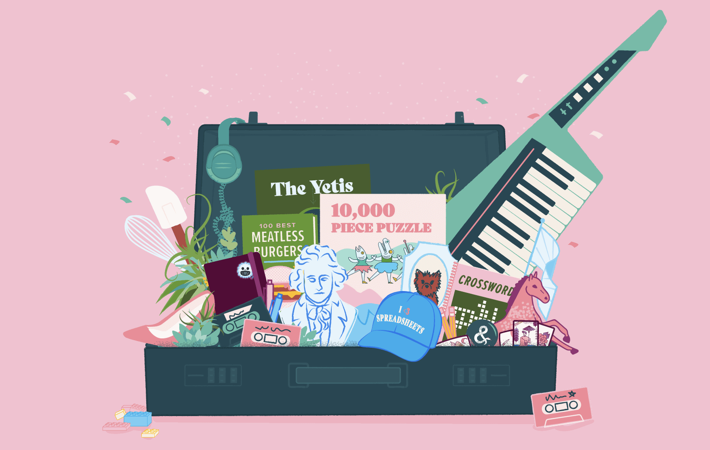

As the [season of the weirdo](https://find.yourweirdos.com) at [&yet](https://andyet.com) is coming to a close, I [wrote this piece to make a business case for weirdness](https://find.yourweirdos.com/posts/weird-is-practical).

> "It may seem counter-intuitive to narrow your focus to a very specific group of people, but when it comes to building customer loyalty, predictable revenue, and truly great products, nothing beats a weirdos-first strategy."
